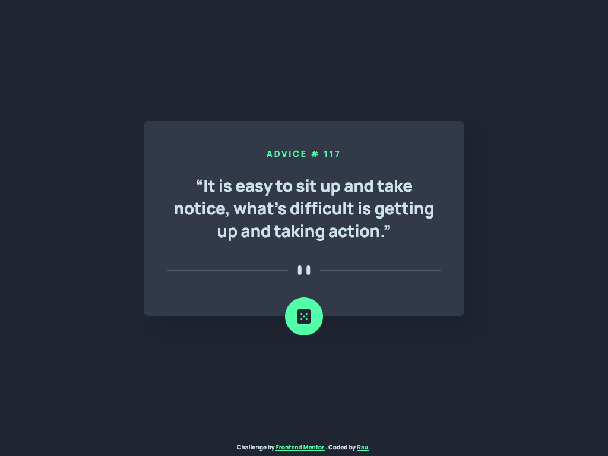

# Frontend Mentor - Advice generator app solution

This is a solution to the [Advice generator app challenge on Frontend Mentor](https://www.frontendmentor.io/challenges/advice-generator-app-QdUG-13db). Frontend Mentor challenges help you improve your coding skills by building realistic projects.

## Table of contents

- [Overview](#overview)
  - [The challenge](#the-challenge)
  - [Screenshot](#screenshot)
  - [Links](#links)
- [My process](#my-process)
  - [Built with](#built-with)
  - [What I learned](#what-i-learned)
  - [Useful resources](#useful-resources)
- [Author](#author)

## Overview

### The challenge

Users should be able to:

- View the optimal layout for the app depending on their device's screen size
- See hover states for all interactive elements on the page
- Generate a new piece of advice by clicking the dice icon

### Screenshot



### Links

- Solution URL: [Frontend Mentor](https://www.frontendmentor.io/solutions/advice-generator-app-html-css-scss-js-css-animations--FfwxcvKWy)
- Live Site URL: [GitHub Pages](https://raubaca.github.io/fm-advice-generator-app/)

## My process

### Built with

- Semantic HTML5 markup
- CSS custom properties
- Flexbox
- CSS Grid
- Mobile-first workflow
- CSS Animations
- Fetch API
- [Sass](https://sass-lang.com/)

### What I learned

With this project I had the opportunity to review again CSS animations.

```css
element {
  animation: anim /* animation settings */;
}

@keyframes anim {
  to {
    /* props to animate */
  }
}
```

### Useful resources

- [Advice Slip JSON API](https://api.adviceslip.com/)
- [hover](https://developer.mozilla.org/en-US/docs/Web/CSS/@media/hover)
- [Using CSS animations](https://developer.mozilla.org/en-US/docs/Web/CSS/CSS_Animations/Using_CSS_animations)

## Author

- LinkedIn - [Raúl Barrera](https://www.linkedin.com/in/raubaca/)
- Frontend Mentor - [@raubaca](https://www.frontendmentor.io/profile/raubaca)
- Twitter - [@raubaca](https://www.twitter.com/raubaca)
